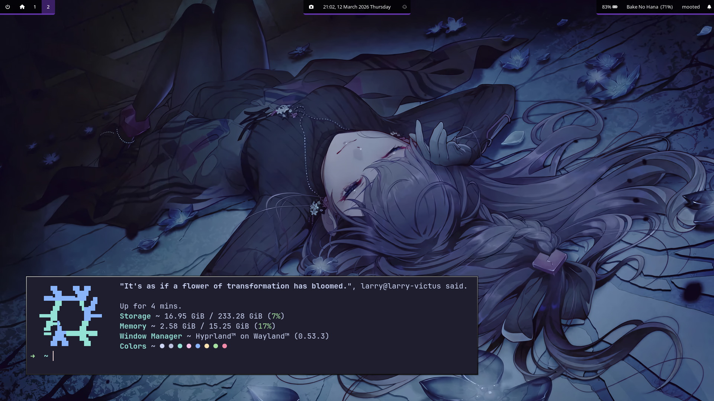

# ConDotFiles by Larry~
  

# Warning!!
Unfortunately, this thing is not ready to use for other users, as it had some quirks that I implemented on the code. But if you are have some suggestions, then **feel free to shoot me a DM on discord (@pixie67) or open a PR for it~**

## Overview
A Config DotFiles *(Hence the name "ConDotFiles")* for my personal NixOS system using **Hyprland & Waybar**.

## History & Thoughts
Back in the early days of this repo, it was structured for my Arch Linux build, only intend to save my dotfiles in case I wanted to reinstall. *(It was a mess back then I swear...)* But that has since changed to a more *kind of* clean looking structure ever since I hopped into NixOS.

As you can see, I'm done with Kana5 tiering (it went terribly) and I had the time to finish rewriting the whole thing, this time with flake-parts and hjem!!

## License
Project is licensed under [MIT License](/LICENSE)~ Use this repo if you want, but remember, credit where credit is due!!